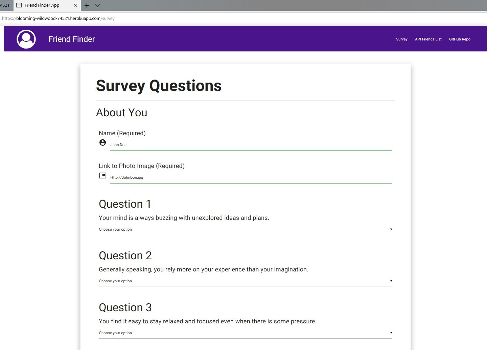

# FriendFinderApp
Find best matched friend from database based on your answers to survey questions

- - -

## Description

*Friend Finder* implements friend matching based on the user's responses to a ten question survey. The user responds to questions with values from 1 (Strongly Disagree) to 5 (Strongly Agree). When the survey is submitted, an existing user record closest to the current user's responses is found and returned. The closest set of user responses is defined as the set with the lowest absolute difference for all ten questions combined.

*Friend Finder* application is meant to simulate a simple dating app. The application is implemented using a [Node.js](https://nodejs.org/en/) and [Express](https://expressjs.com/) server on the back end and the [Materialize](http://materializecss.com/) CSS framework on the front end.

- - -

## Website Link for Friend Finder APP deployed on Heroku

Please click the following link: [Website Heroku Link](https://blooming-wildwood-74521.herokuapp.com/)
 OR  place the following Heroku provided link for my App "`https://blooming-wildwood-74521.herokuapp.com/`" in your web browser

- - -

## How to Use the App & User Interface

There are 2 pages to this application:

1. The homepage @ "`https://blooming-wildwood-74521.herokuapp.com/`"


### On The Homepage
* Click on `GO TO SURVEY` to begin survey on Survey Page.
* Click on `Survey` top right menu to take you to Survey Page.
* Click on `GitHub Repo` at the top of the page or `Reference Work` at the bottom of the page to take you to my GitHub work.
* Click on `API Friends List` top right menu to take you to Array of Friends.

- - -
2. And the survey page adding "`/survey`" to the address above @ "`https://blooming-wildwood-74521.herokuapp.com/survey`"



### On The Survey Page
* Enter your Name, your picture link, and answer questions by selecting dropdown answer option
* Answer `ALL` 10 questions before clicking `SUBMIT RESPONSES`
* Click on `GitHub Repo` at the top of the page or `Reference Work` at the bottom of the page to take you to my GitHub work.
* Click on `API Friends List` top right menu to take you to Array of Friends.


### SUBMIT RESPONSE and see the friend you match


### Click  `DO IT AGAIN`  in the picture to Play again!

- - -

## Installing App To Local Computer

1. Create a folder on your local computer, name is FriendFinder 
2. Make sure you are in the folder in GitBash and then clone the repository
3. Perform NPM Install, should automatically install dependencies within package json file

```
mkdir FriendFinder
git clone "https://github.com/keanamaral/FriendFinderApp.git"
npm i

```

- - -

## Running App Locally

To run the application locally first run `server.js` in your terminal command prompt (make sure you are in the correct folder in the terminal command prompt):
```
node .\server.js
```

To access it in your internet browser, the current `PORT` in the `server.js` is set to `8232`, open an empty internet browser and enter the following in the browser address field and hit enter
```
http://localhost:8232
```

You can change the `PORT` environment variable to the value of your choice in file `server.js`.
```json
...
var PORT = process.env.PORT || 8232;
...
```

If you change the `PORT` to `4250` for example then your server is listening on `PORT 4250` and you will have to enter the new address in your internet browser because your server will be listening on the new `PORT` assigned by you.
```
http://localhost:4250
```